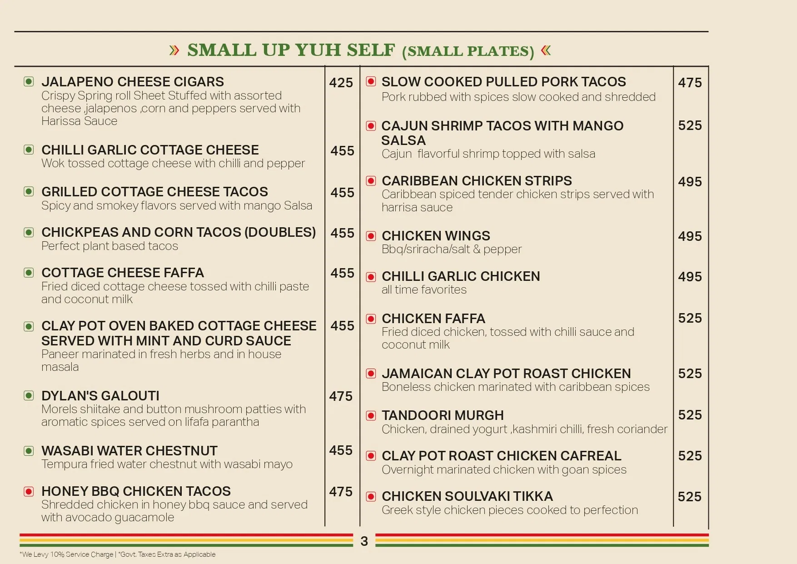

# RAASTA RESTAURANT 🍝

<b>Discriptionb :</b>

This project showcases a series of webpages developed using HTML, based on the theme of “Raasta Restaurant.” The main objective of this project was to design a visually appealing and user-friendly restaurant website that highlights the brand, menu, ambiance, and services offered by the restaurant.

The website includes multiple sections such as a homepage, menu page, about us section, and contact page. Each page is structured using HTML elements to ensure proper layout and readability. The homepage introduces Raasta Restaurant with attractive headings, images, and brief descriptions, creating a strong first impression for visitors.

The menu page displays a variety of food and beverage options in an organized manner, making it easy for users to browse different categories. The “About Us” section provides background information about the restaurant, its theme, and its unique dining experience. The contact page includes essential details such as location, phone number, and a contact form for customer inquiries.

Throughout the project, emphasis has been placed on clean structure, proper use of HTML tags, and basic design principles to ensure a smooth user experience. This project demonstrates foundational web development skills and an understanding of how to create a simple yet effective restaurant website using HTML.

<i><u>Images added :</u></i>




These webpages are created usung html tags such as `<h1></h1>`,`<h2></h2>` , `<b></b>`,`<u></u>`, `<i></i>` , `<a></a>`,``,`<ul></ul>` etc.

index page code :

```html
<!DOCTYPE html>
<html lang="en">
<head>
    <meta charset="UTF-8">
    <meta name="viewport" content="width=device-width, initial-scale=1.0">
    <title> Raasta Restaurant</title>
</head>
<body>
   <b><h1>Welcome to Raasta Restaurant 🍝 </h1></b>
   <i><p>Experience the vibrant flavors of India at Raasta Restaurant. Our menu features a diverse selection of dishes inspired by the rich culinary traditions of India. From aromatic curries to flavorful biryanis, our chefs use the freshest ingredients to create authentic and delicious meals. Whether you're craving a spicy street food snack or a hearty main course, Raasta Restaurant has something for everyone. Join us for a memorable dining experience that celebrates the vibrant culture and cuisine of India.</p></i>
   <a href="pages/about.html" target="_blank">click here to learn more about us</a><br/>
   <a href="pages/menu.html" target="_blank">click here to view our menu</a><br/>
   <a href="pages/contact.html" target="_blank">click here to contact us</a>
</body>
</html>
```

about page code :

```html
<!DOCTYPE html>
<html lang="en">
<head>
    <meta charset="UTF-8">
    <meta name="viewport" content="width=device-width, initial-scale=1.0">
    <title>About </title>
</head>
<body>
   <b><h1>About Us</h1></b>
    <i><p>Raasta Nagpur is primarily known for being the highest rooftop lounge in the city, offering a "luxury dining" atmosphere spread across two levels on the 20th and 21st floors of Ved Solitaire. </p></i><br/>
    <u><h2>Atmosphere & Visual Vibe:</h2></u>
    <ul>
        <li>Stunning Views: The 21st-floor rooftop provides a 360-degree panoramic view of the Nagpur skyline.</li>
        <li>Stunning Views: The 21st-floor rooftop provides a 360-degree panoramic view of the Nagpur skyline.</li>
        <li>Dual-Level Experience:<br/>
            20th Floor: Features a large indoor seating area with a dedicated dance floor.<br/>
            21st Floor: An open-air rooftop setting described by visitors as scenic and aesthetic.</li>
    </ul>       
   <i><b>Overview of Raasta Nagpur</b></i><br/>
    <br/>
    <br/>
    <a href="../pages/menu.html" target="_blank">View Our Menu</a><br/>
    <a href="../pages/contact.html" target="_blank">Contact Us</a><br/> 
    <a href="../index.html" target="_blank">Back to Home</a>
</body>
</html>
```

menu page code :

```html
<!DOCTYPE html>
<html lang="en">
<head>
    <meta charset="UTF-8">
    <meta name="viewport" content="width=device-width, initial-scale=1.0">
    <title>Menu - Raasta Nagpur</title>
</head>
<body>
   <b><h1>Menu</h1></b>
    <i><p>Raasta Nagpur's menu is a vibrant fusion of Caribbean and Indian flavors, offering a diverse range of dishes that cater to various tastes. The menu features a mix of appetizers, main courses, and desserts, with an emphasis on bold spices and fresh ingredients. From flavorful curries and biryanis to grilled meats and seafood, Raasta Nagpur provides a culinary experience that celebrates the rich tapestry of flavors found in both Caribbean and Indian cuisines. Whether you're in the mood for a hearty meal or a light snack, the menu at Raasta Nagpur promises to satisfy your cravings with its unique blend of tastes.</p></i>
  <i><p>Raasta Nagpur offers a multicuisine menu featuring a blend of North Indian, Chinese, Italian, and Caribbean-inspired fast food. Located on the 20th floor of Ved Solitaire in Dharampeth, it is known for its signature rooftop dining experience and diverse food options.</p></i>
<b><h2>Menu Highlights & Popular Dishes:</h2></b>
<p>Based on diner recommendations from <a href="https://www.eazydiner.com/nagpur/raasta-shivaji-nagar-nagpur-692948/menu" target="_blank">EazyDiner</a> and <a href="https://www.zomato.com/nagpur/raasta-dharampeth/order" target="_blank">Zomato</a> popular items include:</p>
<ul>
    <li><b>Starters & Small Plates:</b> Jalapeno Cheese Cigars (₹395), Caribbean Chicken Strips (₹445), and Mushroom Dimsum.</li>
    <li><b>Signature Caribbean Bites:</b> Jamaican Clay Pot Roast Chicken (₹495) and Jerk Chicken Quesadilla (₹399).</li>
    <li><b>Main Course:</b> Mutton Rogan Josh (₹595), Caribbean Chicken Curry (₹545), and Siya Mirch Cottage Cheese (₹495).</li>
    <li><b>Desserts & Beverages:</b> Gulab Jamun, Chocolate Brownie, and a variety of cocktails and mocktails.</li>
    <li><b>Platters:</b> Large sharing options like the Non-Veg Big Boy Platter (₹995) and Veg Big Boy Platter (₹875)</li>
</ul>
<b><h2>Dining Information:</h2></b>
<u><p>Average Cost: approximately ₹1,500 - ₹1,800 for two people.</p></u>
<i><b>menu overview:</b></i><br/>
<br/>
<b><h2>current offers :</h2></b>
<h3><a href="https://www.swiggy.com/restaurants/raasta-dharampeth-nagpur-860426/dineout" target="_blank">swiggy dineout:</a></h3>
<ul>
    <li>Flat 35% Off on lunch (valid 12 PM - 5 PM daily).</li>
    <li>Flat 35% Off on weekends and Flat 20% Off on dinners via pre-booking.</li>
    <li>Flat 10% Off (up to ₹500) on a minimum spend of ₹3,500 for HDFC Infinia cardholders.</li>
</ul>
<a href="../pages/about.html" target="_blank">About Us</a><br/>
    <a href="../pages/contact.html" target="_blank">Contact Us</a><br/> 
    <a href="../index.html" target="_blank">Back to Home</a>
</body>
</html>
```

contact page code :

```html
<!DOCTYPE html>
<html lang="en">
<head>
    <meta charset="UTF-8">
    <meta name="viewport" content="width=device-width, initial-scale=1.0">
    <title>contact page </title>
</head>
<body>
   <b><h1>Contact us</h1></b>
<i><p>Raasta Nagpur, a popular Caribbean lounge and rooftop restaurant, can be reached for reservations at +91 77422 84228. Located on the 20th Floor of Ved Solitaire in Dharampeth Extension, they operate daily from 12:00 PM to 01:30 AM. For updates and to see the vibe, check out Raasta Nagpur on Instagram @raastanagpur</p></i><br/>
<b><h2>Key Contact & Location Details:</h2></b>
<ul>
    <li>Phone (Reservations): <a href="tel:+917742284228">+91 77422 84228</a></li>
    <li>Address: 20th Floor, Ved Solitaire, Cement Rd, Dharampeth Extension, Shivaji Nagar, Nagpur, Maharashtra </li>
    <li>Operating Hours:12:00 PM - 01:30 AM (daily)</li>
    <li>Social Media: <a href="https://www.instagram.com/raastanagpur/" target="_blank">Instagram @raastanagpur</a></li>
    <li>Alternative/Event Contact:<a href="tel:+919561407856">+91 95614 07856</a> or <a href="tel:+918888111775">+91 88881 11775</a> (listed for specific event nights).</li>
</ul>
<a href="../pages/menu.html" target="_blank">View Our Menu</a><br/>
    <a href="../pages/about.html" target="_blank">About Us</a><br/> 
    <a href="../index.html" target="_blank">Back to Home</a>
</body>
</html>
```